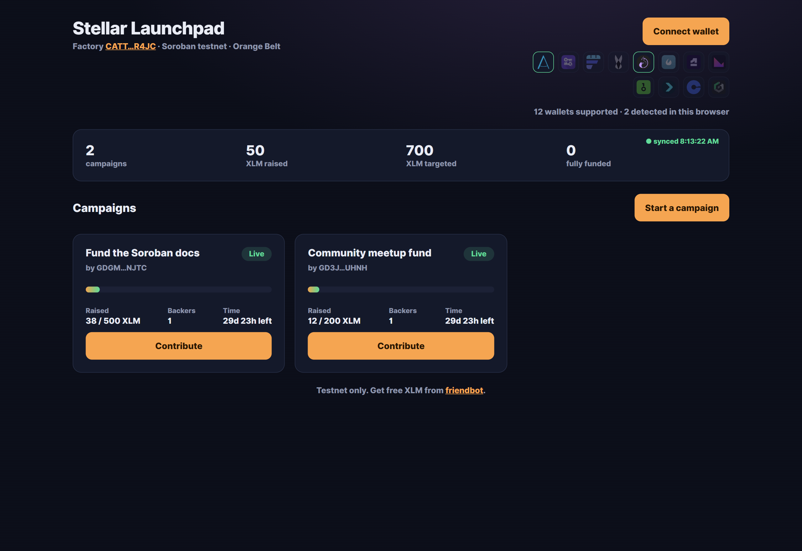
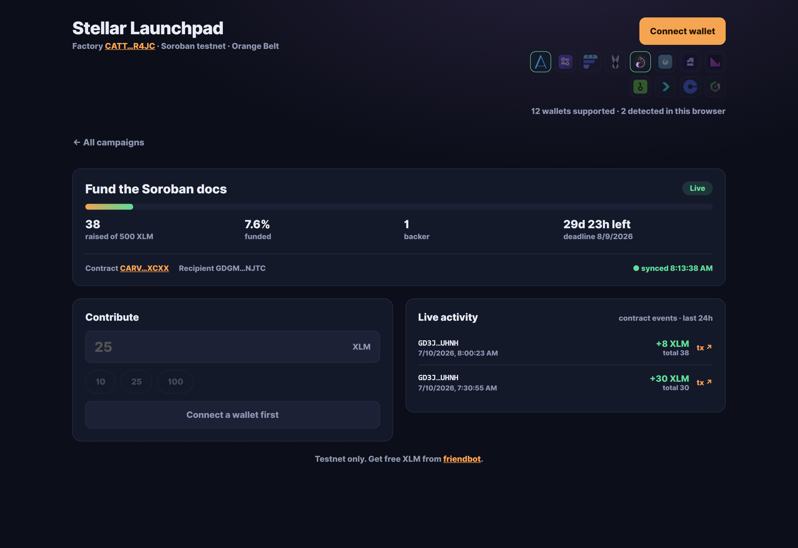
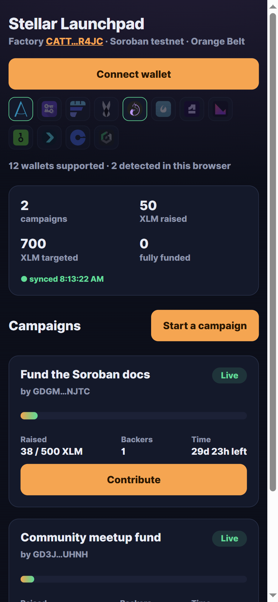
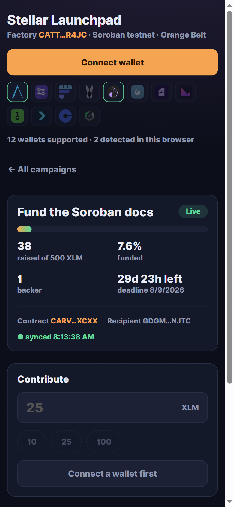

# Stellar Launchpad

A crowdfunding launchpad on Stellar, built from two Soroban contracts that talk to each other.

A **factory** deploys a fresh **campaign** contract for every fundraiser, remembers where each one
lives, and aggregates their state on demand. Each campaign escrows contributions in a token contract
until its deadline: if the goal is met the recipient withdraws, and if it isn't every contributor can
pull their own money back.

Built for **Level 3 — Orange Belt** of the [Stellar Journey to Mastery](https://www.risein.com/programs/stellar-journey-to-mastery-monthly-builder-challenges) builder challenge.

**Live demo:** https://itsgriznft.github.io/stellar-launchpad/

---

## On-chain artifacts

Everything below is live on Stellar **testnet**.

| | |
|---|---|
| **Factory contract** | [`CATTEK3T244RH3FR7REACNB3XXFCW4CG7R7U7WHPYPZM2H36NIP6R4JC`](https://stellar.expert/explorer/testnet/contract/CATTEK3T244RH3FR7REACNB3XXFCW4CG7R7U7WHPYPZM2H36NIP6R4JC) |
| **Campaign wasm hash** | `42edbba3bde26ce3ea7c4ab4307323b9ce1c43f4722f9bd631771303ab6b38f7` |
| **Campaign #1** (factory-deployed) | [`CARVL57ZINRL3ORII4VYBG5Z6UUUNJPFTN4S2RGWRYRHNK2Q5NXIXCXX`](https://stellar.expert/explorer/testnet/contract/CARVL57ZINRL3ORII4VYBG5Z6UUUNJPFTN4S2RGWRYRHNK2Q5NXIXCXX) |
| **Campaign #2** (factory-deployed) | [`CCZOY7VLDW5PIEND37OR6YIWXSYFLV7X4K2XVJ2GO354M3GHJAF23NMC`](https://stellar.expert/explorer/testnet/contract/CCZOY7VLDW5PIEND37OR6YIWXSYFLV7X4K2XVJ2GO354M3GHJAF23NMC) |
| **Contract call — `contribute`** | [`ec60d7586cc6ccb141eaeeefbcd52793ed5215c65bdc279b506ddcad05efee71`](https://stellar.expert/explorer/testnet/tx/ec60d7586cc6ccb141eaeeefbcd52793ed5215c65bdc279b506ddcad05efee71) |
| **Contract call — `contribute`** | [`c1e3860386d69ce73a9ef4123ba03ef0c56268b895e07d035785ad270636e92a`](https://stellar.expert/explorer/testnet/tx/c1e3860386d69ce73a9ef4123ba03ef0c56268b895e07d035785ad270636e92a) |
| **Campaign token** | Native XLM, via its Stellar Asset Contract |

The recorded wasm hash is reproducible: `make build` on this tree produces a `campaign.wasm` whose
sha256 is exactly the hash the factory deploys from.

## Screenshots

**Launchpad** — stats and every campaign card come from the factory's cross-contract reads.



**Campaign** — progress bar and activity feed both driven by on-chain events.



**Mobile** — the same two views at 390px.

<p>
  
  
</p>

**Tests** — 26 contract tests and 41 frontend tests. Full output in [screenshots/test-output.txt](screenshots/test-output.txt).

---

## Inter-contract communication

This is the heart of the project. Three distinct kinds of contract-to-contract calls:

```
                    ┌──────────────────────────────────────────┐
                    │              Factory                     │
                    │  create()  listing()  stats()            │
                    └───┬──────────────┬───────────────────────┘
       1. deploy_v2 +   │              │  2. cross-contract read
          constructor   │              │     state()
                        ▼              ▼
                    ┌──────────────────────────────────────────┐
                    │        Campaign (one per fundraiser)     │
                    │  contribute()  withdraw()  refund()      │
                    └───────────────────┬──────────────────────┘
                                        │  3. nested token call
                                        ▼     transfer()
                    ┌──────────────────────────────────────────┐
                    │   Stellar Asset Contract (native XLM)    │
                    └──────────────────────────────────────────┘
```

1. **Deployment.** `Factory::create` calls `deploy_v2` with the campaign's wasm hash and the
   constructor arguments, so a new campaign contract exists and is initialised in one transaction.
   The address is derived from a salt over `(creator, index)`, so one creator can run several
   campaigns without collisions.

2. **Cross-contract reads.** `Factory::listing` and `Factory::stats` call `state()` on each deployed
   campaign and aggregate the answers. Each call costs resources, so `stats` visits at most 50
   campaigns and returns `aggregated` alongside `campaigns` — a caller can tell a partial total from
   a complete one instead of silently trusting a truncated sum.

3. **Nested token calls.** A campaign's `contribute` calls `transfer` on the token contract. That
   call reverts the whole invocation when the contributor is short on funds, which is where the
   frontend's `INSUFFICIENT_BALANCE` ultimately comes from.

The factory stores only the campaign's *wasm hash*. A deployed campaign is an ordinary, independent
contract afterwards — the factory cannot touch its funds.

---

## The contracts

### `contracts/campaign`

| Function | Auth | Description |
|---|---|---|
| `__constructor(token, recipient, title, goal, deadline)` | — | Rejects a non-positive goal or a deadline in the past |
| `contribute(contributor, amount)` | contributor | Transfers the token into escrow, emits `contributed` |
| `withdraw()` | recipient | Only after the deadline, only if the goal was met, only once |
| `refund(contributor)` | contributor | Only after the deadline, only if the goal was missed |
| `state()` | — | Title, goal, deadline, raised, backers, withdrawn |
| `contribution(address)` | — | What one address has put in |

Events: `contributed`, `withdrawn`, `refunded` — each carries the address as an indexed topic.

### `contracts/factory`

| Function | Auth | Description |
|---|---|---|
| `__constructor(admin, token, campaign_wasm)` | — | Pins the wasm every campaign is deployed from |
| `create(creator, title, goal, deadline)` | creator | Deploys a campaign, returns its address, emits `created` |
| `listing(start, limit)` | — | Pages the campaigns, reading `state()` from each |
| `stats()` | — | Totals across the campaigns |
| `campaigns()` / `is_campaign(address)` | — | What this factory deployed |
| `set_campaign_wasm(wasm)` | admin | Redirects *future* deployments; existing campaigns are untouched |

Events: `created`, `wasm_set`.

---

## Frontend

**Multi-wallet.** [Stellar Wallets Kit](https://stellarwalletskit.dev/) v2 registers every module
that works without extra configuration — Freighter, xBull, Albedo, Lobstr, Rabet, Hana, Klever,
OneKey, Bitget, Fordefi, Cactus Link, D'CENT. The header marks which are installed.

**Real-time updates.** The activity feed and both progress bars are driven by polling `getEvents`
from a cursor. A contribution made by anyone — from this UI or from the CLI — appears within about
five seconds, without a page reload.

**Transaction status.** Every write walks *simulating → signing → submitting → confirming →
success/failed*, and links the resulting hash to Stellar Expert.

**Loading states.** Skeletons cover the first read only. A failed poll leaves the last good data on
screen rather than blanking the page.

**Error handling.** Failures are classified rather than dumped as raw strings:

| Kind | When |
|---|---|
| `WALLET_NOT_FOUND` | Chosen wallet isn't installed, or returned no address |
| `USER_REJECTED` | You declined the signature in the wallet |
| `INSUFFICIENT_BALANCE` | Amount exceeds spendable balance — caught before signing, and again from the token contract's `BalanceError` (`Error(Contract, #10)`) |
| `ACCOUNT_NOT_FUNDED` | Account doesn't exist on testnet yet |
| `CONTRACT_REJECTED` | A contract said no (campaign ended, goal met, title too long…) |
| `NETWORK` | RPC unreachable, or the transaction didn't confirm in time |

**Mobile.** Single-column below 900px, 44px tap targets, and no horizontal scroll at any width from
320px up — verified by measuring `scrollWidth` against `clientWidth`, not by eye.

---

## Running it locally

**Prerequisites:** [Rust](https://rustup.rs/) with the `wasm32v1-none` target, Node 22+, and
optionally the [Stellar CLI](https://developers.stellar.org/docs/tools/developer-tools/cli/install-cli)
(needed to deploy; the build falls back to plain cargo without it).

```bash
rustup target add wasm32v1-none
```

### Contracts

```bash
make build   # campaign wasm first, then factory — the order matters
make test    # 26 unit tests
```

> The factory embeds the campaign's contract spec via `contractimport!`, so the campaign wasm must
> exist before the factory can compile. `make` encodes that ordering; a bare `cargo test` on a clean
> checkout will fail until `make campaign` has run once.

### Deploy your own launchpad

```bash
./scripts/deploy.sh testnet
```

That uploads the campaign wasm, deploys a factory pointing at the hash, and writes the ids to
`deployments/testnet.json`. Then create a campaign:

```bash
stellar contract invoke --id <FACTORY_ID> --source deployer --network testnet \
  -- create --creator "$(stellar keys address deployer)" \
  --title "Fund the Soroban docs" \
  --goal 5000000000 \
  --deadline $(( $(date +%s) + 2592000 ))
```

`goal` and `amount` are in **stroops** (1 XLM = 10,000,000 stroops); `deadline` is a Unix timestamp.

### Frontend

```bash
cd web
npm install
npm run dev      # http://localhost:5173
npm test         # 41 unit tests
npm run lint
```

Point it at your own factory with `VITE_FACTORY_ID`; otherwise it uses the one above.

```bash
VITE_FACTORY_ID=C... npm run dev
```

### Watch the real-time feed work

With the page open, contribute from the CLI. The progress bar and activity feed move on their own:

```bash
stellar keys generate alice --network testnet --fund

stellar contract invoke \
  --id CARVL57ZINRL3ORII4VYBG5Z6UUUNJPFTN4S2RGWRYRHNK2Q5NXIXCXX \
  --source alice --network testnet \
  -- contribute --contributor "$(stellar keys address alice)" --amount 300000000
```

---

## Layout

```
contracts/campaign/      one fundraiser: escrow, withdraw, refund, events
contracts/factory/       deploys campaigns, aggregates their state
scripts/deploy.sh        upload wasm -> deploy factory -> record ids
deployments/             what is live, per network
web/src/lib/rpc.ts       simulate / sign / submit / confirm
web/src/lib/factory.ts   listing, stats, create
web/src/lib/campaign.ts  state, contribute, event paging
web/src/lib/errors.ts    error classification
web/src/hooks/           polling for the launchpad and one campaign
.github/workflows/       CI (fmt, tests, lint, build) and Pages deploy
```

## Notes

- `ed25519-dalek` is pinned to 2.2.0 in `Cargo.lock`: `soroban-env-host` declares an open
  `>=2.0.0` requirement, and 3.0.0 changed the `rand_core` bounds it relies on.
- The activity feed backfills the last ~24h of events, not the RPC's full ~7-day retention window:
  a full backfill costs a dozen round trips. Campaign totals come from `state()`, which is exact
  regardless of the feed window.
- The RPC accepts at most 5 event filters of 5 contract ids each, so at most 25 campaigns can be
  watched at once. The client reports how many it subscribed to rather than truncating silently.
- Testnet data is periodically reset. If the contract addresses 404, redeploy with `./scripts/deploy.sh`.

## License

MIT
